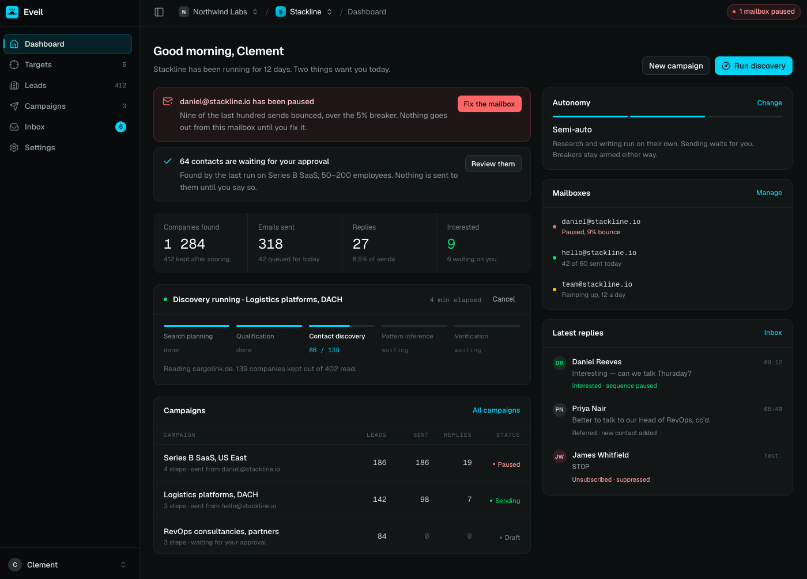

<p align="center">
  
</p>

<h1 align="center">Eveil</h1>

<p align="center">
  Organic, automated AI marketing that finds its own customers.
</p>

<p align="center">
  <a href="#licence"></a>
  
  
  
</p>

Enter your product's website, Eveil reads it, works out who buys it, goes
looking for those companies, finds the people at them, writes the email
sequence, sends it from your own mailbox, and reads the replies.

Your own AI CMO, running its own army of agents. Lead discovery and outreach
are B2B; LinkedIn posting and Reddit reply drafting (both evidence-driven)
already work for anyone building an online presence, B2C solo founders
included.

That's automation of the same work a human researcher would do by hand:
searching the web for the right companies and people, then writing to them one
by one from a real mailbox. It is not a purchased contact list, and it does
not send through a shared pool of pre-warmed inboxes on your behalf — every
lead is found live, and every mail leaves through the mailbox you connected.
Slower to start than buying a list. Honest the whole way through.

Self-hostable, AGPL-3.0, and the free edition has no artificial limits:
unlimited mailboxes, unlimited leads, your data on your own machine.

> **Status: v0 + cloud backbone.** The whole outbound loop works end to end:
> site analysis, lead discovery, sequences, sending, replies, plus
> organizations, roles, and pay-as-you-go billing for the cloud edition.
> LinkedIn posting (personal profile, official API) is in too, and so is
> Reddit reply drafting - manual-publish only for now, since Reddit is
> currently blocking new API app registration. Not built yet: a public API,
> commenting on someone else's LinkedIn post. See
> [Issues](https://github.com/Dricle/eveil/issues) for exactly what's left.

---

<p align="center">
  
</p>

---

## Features

- **Reads your site, not a form you fill in.** Product, audience, and the
  reason anybody switches, worked out from the site itself and shown to you
  before anything gets written. It can also read your github repo for a better understanding of your project.
- **Finds the companies and the people, on its own.** Segments, search terms,
  fit scores with the sentence that justifies them, over two independent
  bundled search engines plus OpenStreetMap, no paid data API required to
  start. See [how discovery finds companies](https://docs.eveil.cloud/product/discovery).
- **Writes sequences that sound like you.** One AI-writing-style box per
  project (tone, language, banned words) that every generated mail obeys.
- **Ask Evie instead of clicking through screens.** A chat panel that plans and
  calls the same agents the app's triggered flows use - "find me 50 dental
  clinics in Lyon" - and pauses for your approval before anything that spends
  credits actually runs.
- **Sends from your own mailbox.** Plain SMTP, no relay, no shared sending
  domain: what arrives is indistinguishable from something you typed.
- **Posts to LinkedIn too, evidence-driven.** A knowledge-base fact, a client
  you just won, or relevant industry news, drafted and queued for your
  approval before anything goes out - official API, personal profile, no
  automation of connection requests or messages.
- **Finds Reddit threads worth replying to.** Live subreddits and evergreen
  "best X" threads already ranking on Google, drafted in the thread's own
  tone. Copy, post it yourself, mark it posted - no OAuth, since Reddit is
  currently blocking new API app registration.
- **Reads and threads replies itself**, over IMAP, matched on the mail's own
  `Message-ID` so a reply always attaches to the lead it answers.
- **A bounce circuit breaker**, scoped per mailbox, that pauses sending before
  a bad batch burns a domain's reputation, not per campaign, per address.
- **Self-hosted and AGPL-3.0.** Four containers, five minutes, your data never
  leaves your machine unless you choose the cloud edition.
- **No dark patterns.** No open-tracking pixel, no mailbox warm-up, no OAuth
  lock-in, no purchased contact database. See
  [what it deliberately does not do](#what-it-deliberately-does-not-do).

---

## Self-hosted or cloud

Two ways to run it, same code, no feature gate between them.

**Self-hosted.** Free, forever, AGPL-3.0. No per-seat or per-mailbox fee.
Bring your own AI provider key (Anthropic, OpenAI, whichever you already pay
for) and your data never leaves your machine. Organizations, roles and
multi-user access are core to both editions, not held back for cloud.
Your install starts with limited knowledge of the web and grows smarter on
its own from there.

**Cloud.** Managed hosting at eveil.cloud, with pay-as-you-go credits instead
of an AI provider account: top up whatever amount you choose, spend it at one
flat published rate, no plans and no subscription. It's smarter from day one,
too: the search-host registry and the page-cache discovery it draws on grow
with every customer, so a new account skips the cold start a fresh
self-hosted install has to work through alone. Cloud does not unlock
features; it removes setup, hosting and the AI-key requirement.

1,000 credits is about $1 of AI cost, and SMTP sending, IMAP reading and
email verification cost nothing: most competitors bill verification. A full
100-lead campaign runs about 3,500 credits end to end. New accounts start
with a trial grant, capped to one project and to leads discovered rather than
just credits spent, with no CSV export before a first payment.

---

## Installing

You need Docker and about five minutes.

```bash
git clone https://github.com/Dricle/eveil.git
cd eveil
cp deploy/.env.example .env
```

Three values to fill in, two more you can leave alone:

| Variable | What it is |
| --- | --- |
| `APP_URL` | The address people actually type. Every link the app generates is built from it. |
| `DB_PASSWORD` | Any long random string. The stack creates the database with it. |
| `SEARXNG_SECRET` | Any long random string. Only signs the bundled search engine's own requests. |
| `ADMIN_EMAIL`, `ADMIN_PASSWORD` | Optional. Set them and the first account is created on boot; leave them empty and the setup screen asks instead. |
| `APP_PORT` | Optional, **defaults to `80`**. The host port the app is published on. Change it if something already holds 80. |

Leave `APP_KEY` and `CREDENTIALS_KEY` empty: they are generated on first boot.
Fill them in only if you would rather manage them yourself; anything set there
wins.

Leave the `MAIL_*` block for later too: the app boots without it, but
password resets, member invitations and email verification need it filled in
before they can actually send. See [Configuration](https://docs.eveil.cloud/self-hosted/configuration).

Then bring it up:

```bash
docker compose -f compose.deploy.yaml up -d
```

Open `APP_URL`. You land on the setup screen, or on the login if you set the
`ADMIN_*` pair. Migrations run on boot, before anything serves a request or picks
up a job.

The app speaks plain HTTP: TLS, a reverse proxy or a tunnel, what actually runs
in the four containers, the app's own transactional mail, and where the
encryption keys live — the full [Installation](https://docs.eveil.cloud/self-hosted/installation)
and [Configuration](https://docs.eveil.cloud/self-hosted/configuration) docs cover
all of that. `-f compose.deploy.yaml` on every command gets old fast; put
`COMPOSE_FILE=compose.deploy.yaml` in `.env` and drop it.

### Updating

```bash
./update.sh
```

See [Updating](https://docs.eveil.cloud/self-hosted/updating) for rolling back, and
[Backup](https://docs.eveil.cloud/self-hosted/backup) before you do.

---

## First run

Sign in and give it the address of your product. That is the whole setup: the
rest is a guided run you watch and agree with:

1. **It reads your site.** A minute or two, page count ticking up on screen.
2. **It shows you what it understood**: what the product does, who it is for,
   why anybody switches. Agree, or correct it first. Every mail is written from
   this, so correcting it now is cheaper than correcting it in three hundred
   mails.
3. **Agreeing starts the segments**: who buys it, and the search terms that find
   each one.
4. **Agreeing to those starts the searching**, one search per segment you left
   switched on. Companies appear in Leads with a fit score and the sentence that
   justifies it.

Nothing is written to anybody during any of that. Sequences arrive as drafts and
nothing sends until you activate a campaign.

Under Settings, Project, there is a box for how the AI writes: tone, language,
words never to use. It starts with one rule already in it, banning dash
punctuation, because that is one of the cheapest tells that a machine wrote a
sentence. Everything whose output you read as prose obeys it, from the product
portrait to the opening line of a mail. Edit it or empty it as you like.

Two things the app will nag you about at the top of every screen, because
neither announces itself otherwise:

- **No AI provider key** (shown to the instance's superadmin only, since nobody
  else can fix it). Without one every agent fails in the queue. Settings → App
  settings → Provider. The "test" button says exactly why a key was refused,
  which beats finding out from a job that dies an hour later.
- **No mailbox on this project.** Everything up to writing a sequence works, but
  a campaign will activate and then sit there. Settings → Mailboxes: plain SMTP
  and IMAP, no OAuth, with presets for Infomaniak, OVH, Gandi, Zoho, Gmail and
  Microsoft 365 — see [Configuration](https://docs.eveil.cloud/self-hosted/configuration) for the
  Gmail/Workspace and Microsoft 365 connection quirks, and for testing the whole
  loop (search → sequence → send → reply) against your own mailbox before you
  point it at real leads.

---

## Working on it

The development stack is Laravel Sail, at the root of the repository:

```bash
cp .env.example .env
./vendor/bin/sail up -d
./vendor/bin/sail artisan key:generate
./vendor/bin/sail artisan eveil:credentials-key
./vendor/bin/sail artisan migrate
yarn install && yarn dev
```

Host ports are shifted so this runs beside other projects: app on 8080, Postgres
on 5442, Redis on 6382, Mailpit on 8035.

**PHP runs in the container, JS tooling runs on the host.** `node_modules` is
installed with macOS binaries and mounted into a Linux container, so eslint and
Vite fail inside Sail; and the host PHP must be 8.4+, because `yarn build` shells
out to `php artisan wayfinder:generate`. For the same reason, never run
`wayfinder:generate` inside the container. It emits route modules without the
`.form()` helper and the type check then fails in files you did not touch.

```bash
./vendor/bin/sail artisan test          # the suite
./vendor/bin/sail composer lint         # Pint
yarn lint:check && yarn types:check     # eslint, vue-tsc
```

Postgres is required, including for tests: the schema leans on JSONB, partial
unique indexes and `ilike`, so SQLite would pass tests that production fails.

Two documents are worth reading before changing anything.
`GUIDELINES.md` holds the decisions and the reasoning behind them; `.ai/rules/`
holds the settled conventions and the traps somebody already walked into.

---

## What it deliberately does not do

- **No open tracking.** No pixel, no link rewriting. Apple's Mail Privacy
  Protection and Gmail's image proxy make open counts fiction, and the pixel
  costs inbox placement. The metric here is the reply.
- **No mailbox warm-up.** Warm-up serves high volume from fresh domains, which is
  not what this is for, and shared warm-up networks are increasingly a negative
  signal to Google and Microsoft.
- **No OAuth.** SMTP and IMAP credentials only.
- **No unsubscribe link.** Nobody subscribed to anything, so an unsubscribe
  button contradicts a hand-written message. The opt-out is a sentence in the
  body, and a reply asking to stop suppresses the address immediately.
- **No purchased contact database.** Every lead here was found and read.

---

## Licence

AGPL-3.0. If you run a modified version as a service, you have to publish your
changes.
